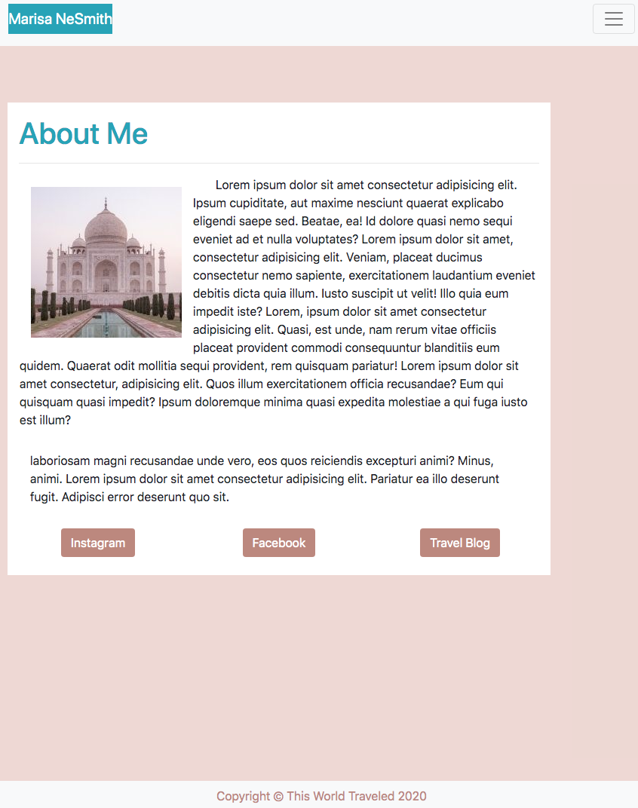
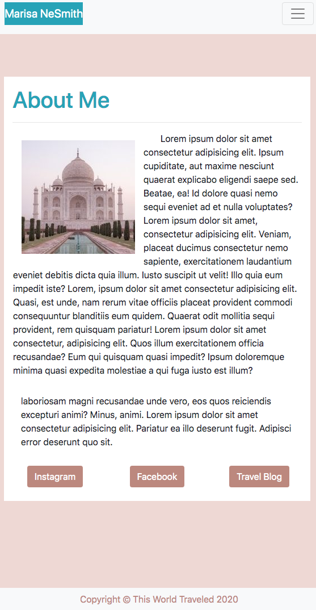
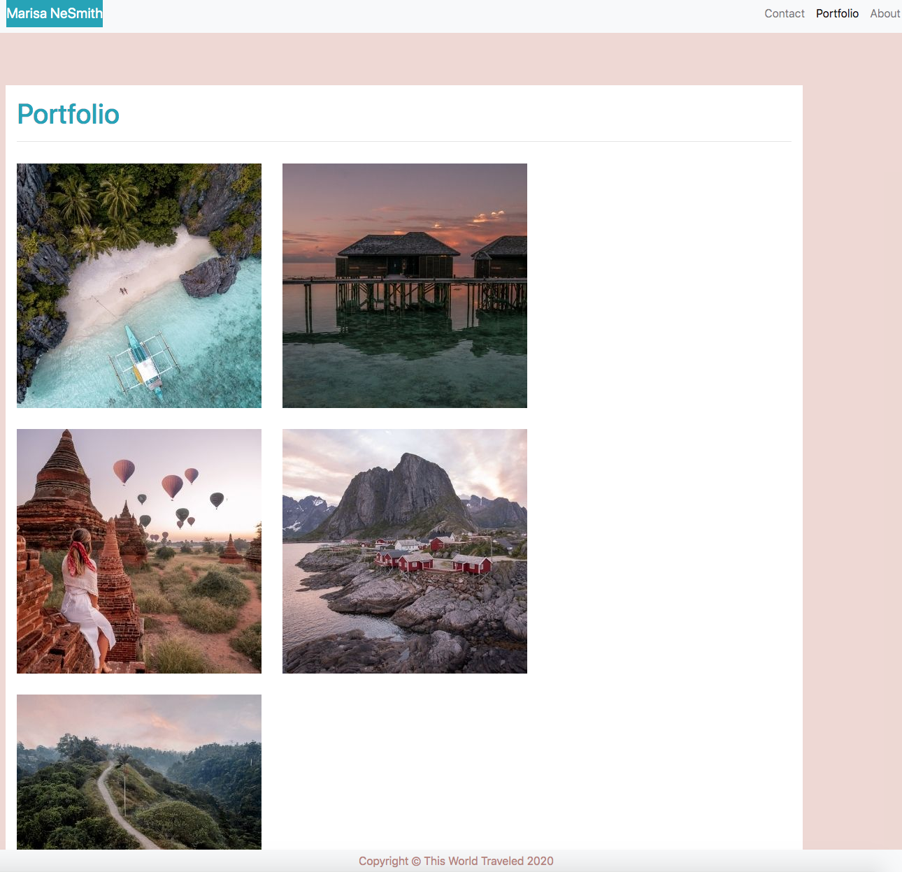
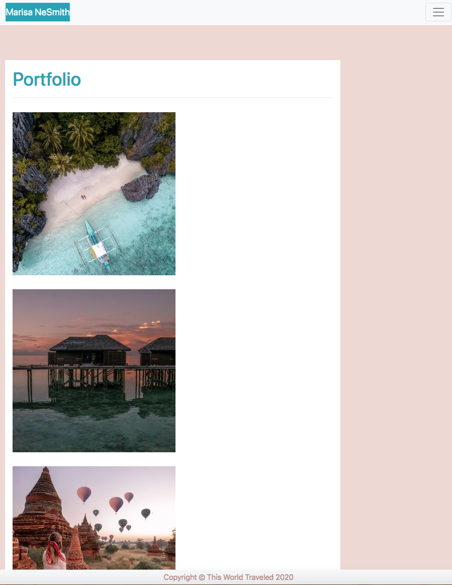
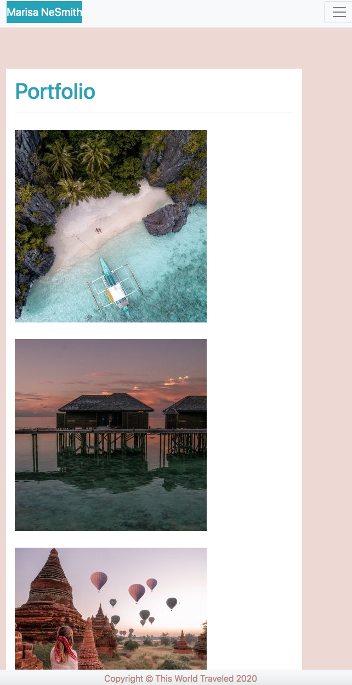
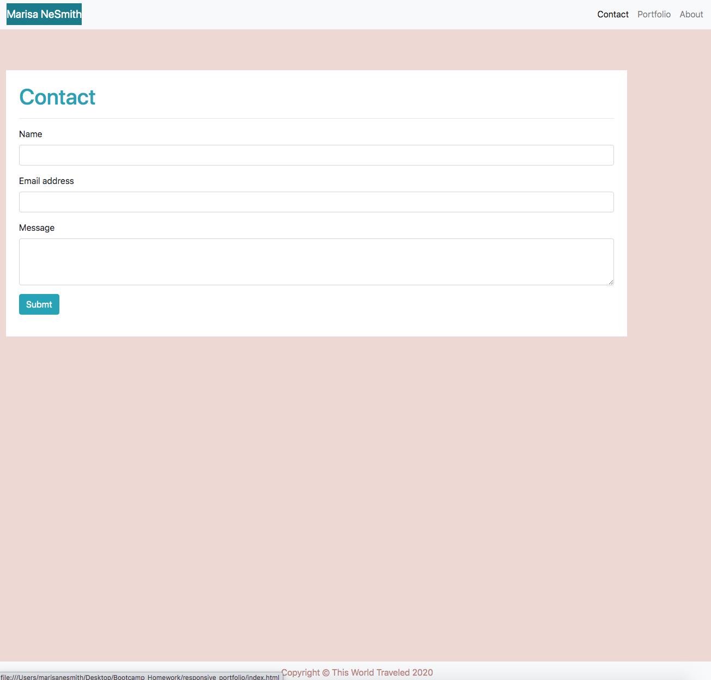
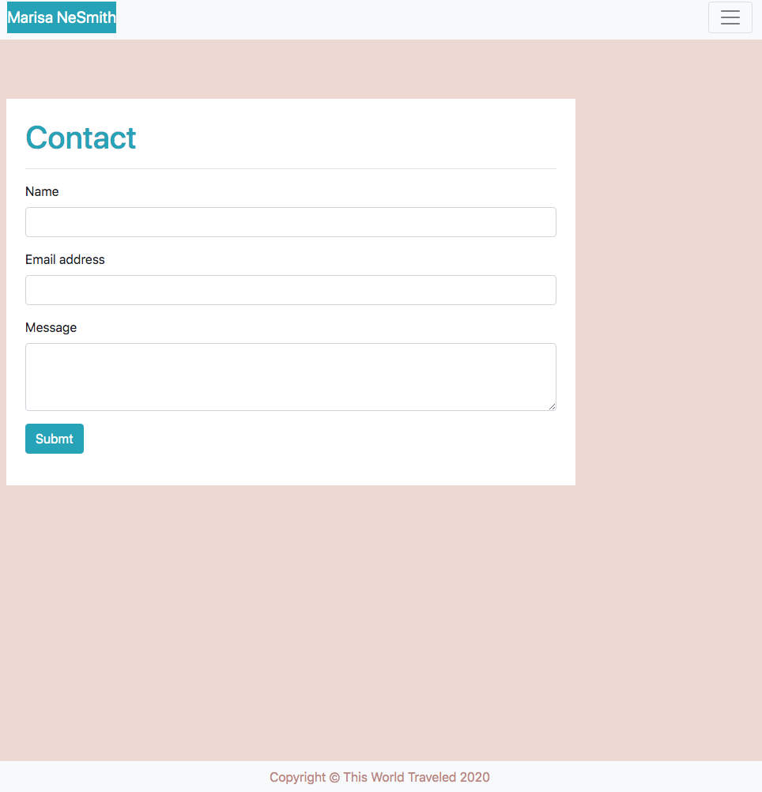
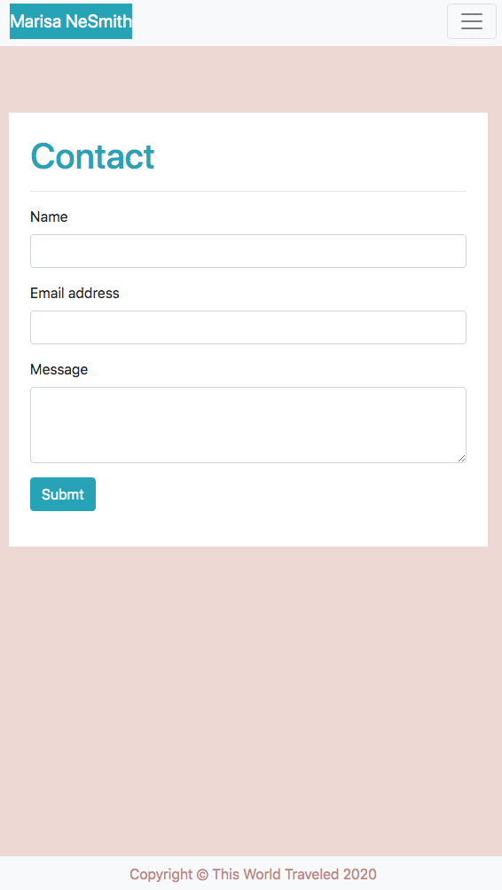

# responsive_portfolio

The purpose of this project is to create a responsive portfolio website with multiple pages using bootstrap. In this project I have created an About Me page, a Portfolio with pictures and a Contact page. I created buttons on my About Me page which links to my social media sites.

## Table of Contents
* [Add Bootstrap Reference Links](#add-bootstrap-reference-links)
* [Create a Responsive About Me Page](#create-a-responsive-about-me-page)
* [Create a Responsive Portfolio Page](#create-a-responsive-portfolio-page)
* [Create a Responsive Contact Page](#create-a-responsive-contact-page)
* [Providing a URL for the Website](#Providing-a-URL-for-the-Website)
* [Credits](#Credits)

## Add Bootstrap Reference Links
1. Add Bootstrap Reference Links for CSS and JS from the getbootstrap webpage

## Create a Responsive About Me Page
1. Use Bootstrap to create the About Me page 

  

## Create a Responsive Portfolio Page
1. Use Bootstrap to create the Portfolio page

## Create a Responsive Contact Page
1. Use Bootstrap to create the Contact page

## Providing a URL for the website

[GitHub Live Site](https://marisanesmith.github.io/responsive_portfolio)

## Credits

* William Chenausky (https://github.com/wchenausky)
* Ethan Dutcher (https://github.com/edutcher)
* W3 Schools (https://w3schools.com)