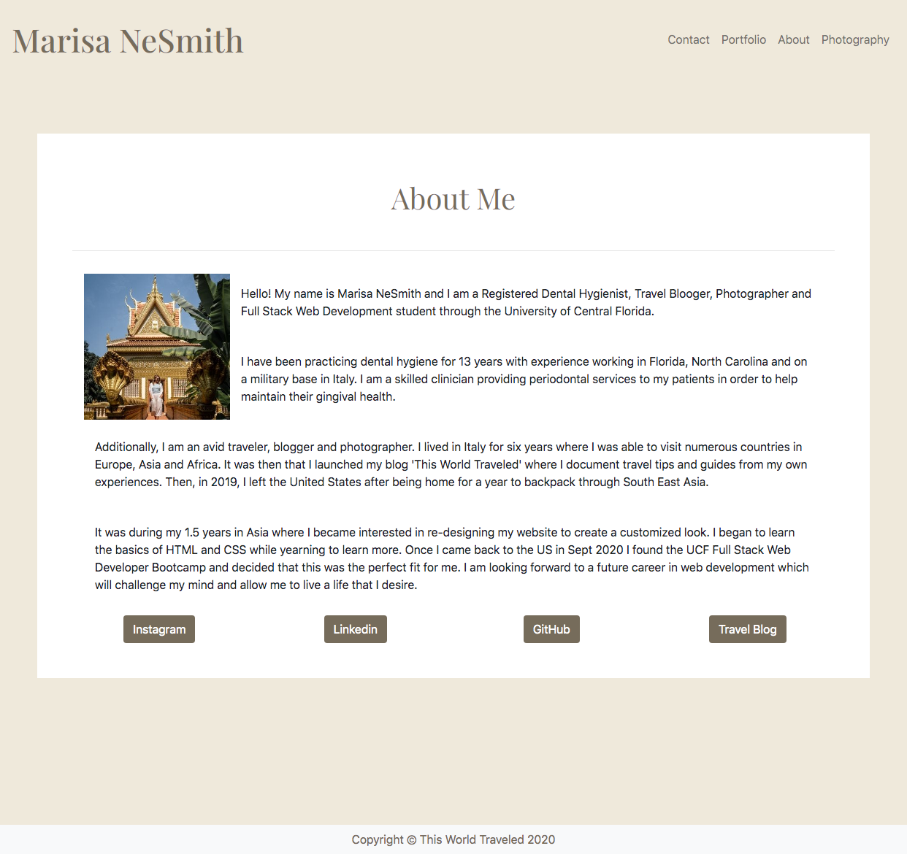
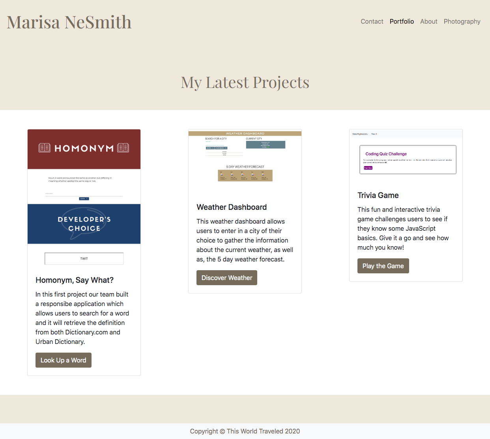
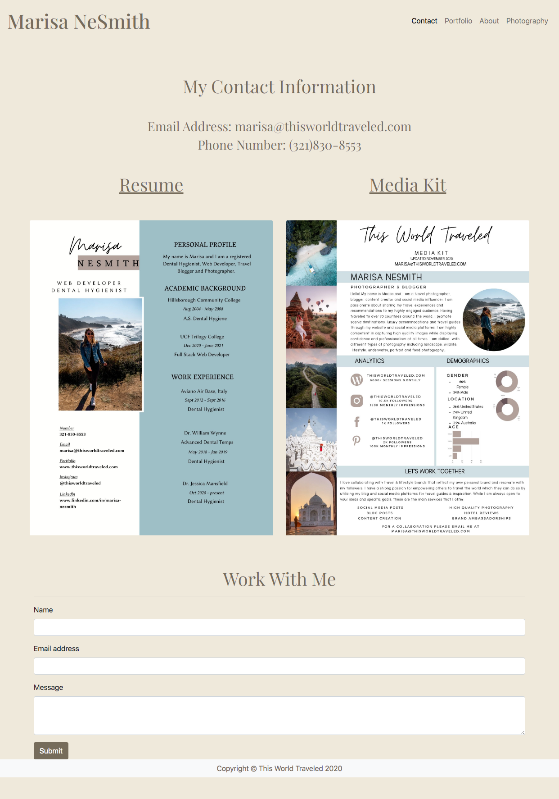
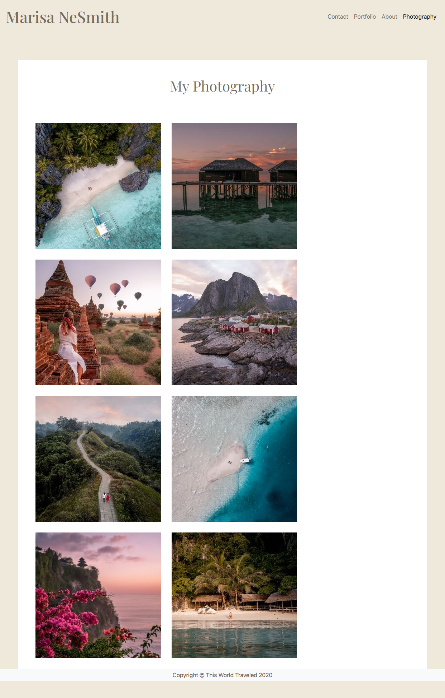

# responsive_portfolio

This portfolio serves as my online resume with an about me section, a contact page, and a portfolio page to show of the projects that I have created during my time in the web development bootcamp. I have also included a photography page to showcase my work as a travel photographer. Located on the About Me page you will find links to my LinkedIn profile and GitHub page where you can view my additional projects and respositories. 

## Table of Contents
* [Add Reference Links](#add-reference-links)
* [Create a Responsive About Me Page](#create-a-responsive-about-me-page)
* [Create a Responsive Portfolio Page](#create-a-responsive-portfolio-page)
* [Create a Responsive Contact Page](#create-a-responsive-contact-page)
* [Create a Responsive Photography Page](#create-a-responsive-photography-page)
* [Providing a URL for the Website](#Providing-a-URL-for-the-Website)
* [Credits](#Credits)

## Add Reference Links
1. HTML
2. CSS
3. Bootstrap Framwork

## Create a Responsive About Me Page

## Create a Responsive Portfolio Page

## Create a Responsive Contact Page

## Create a Responsive Photography Page

## Providing a URL for the website

[GitHub Live Site](https://marisanesmith.github.io/responsive_portfolio)
